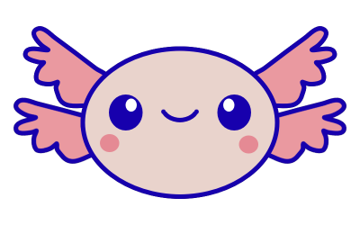

> [!NOTE]
> Axolotl2D is in active development. The articles describe the API currently in this repository. If you run into a problem, ask on [Discord](https://discord.gg/hMRWUTa) or compare your code with the [example project](https://github.com/Naamloos/Axolotl2D/tree/master/Axolotl2D.Example).

# Axolotl2D

Axolotl2D is a lightweight .NET 2D game framework built on [Silk.NET](https://github.com/dotnet/Silk.NET). It provides a Unity-like composition model without imposing an editor: scenes own GameObjects, GameObjects own components, and Microsoft dependency injection constructs the application.

The framework includes scene-level DI scopes, runtime GameObject creation and deferred destruction, input actions, scaled time and fixed updates, typed assets, sprite batching, scoped custom shaders, cameras, transform hierarchies, animation, text, audio, and Box2D physics.

## Where to begin

- [Getting Started](articles/getting-started.md)
- [Architecture and Dependency Injection](articles/architecture-and-dependency-injection.md)
- [GameObjects and Components](articles/gameobjects-and-components.md)
- [Asset Management](articles/asset-management.md)
- [Sprites and Sprite Batching](articles/sprites-and-sprite-batching.md)
- [Input Actions](articles/input-actions.md)
- [Box2D Physics](articles/physics.md)
- [Framework Roadmap](articles/framework-roadmap.md)
- [API Reference](api/Axolotl2D.yml)

## Project links

- [Example Project](https://github.com/Naamloos/Axolotl2D/tree/master/Axolotl2D.Example)
- [GitHub Repository](https://github.com/Naamloos/Axolotl2D)
- [License](https://github.com/Naamloos/Axolotl2D/blob/master/LICENSE)
- [Discord](https://discord.gg/hMRWUTa)
- [Donate](https://ko-fi.com/naamloos)
